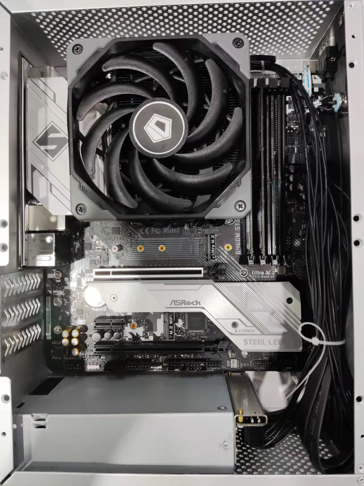
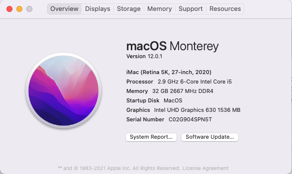

### Process status

- [``Installable``](https://github.com/17x/hackintosh-i5-10400-asrock-b460m-steel-legend/releases/tag/installable)

  Use this EFI you can successfully finish installation and enter system UI interface, all things are fine but ethernet are ``not working`` , a part of usb ports ``cannot be use``, and ``never been wake up`` from sleep status by interaction from mouse or keyboard.

### Systems

[Open Core 0.7.5](https://github.com/acidanthera/OpenCorePkg/releases/tag/0.7.5)

[Monterey 12.0.1](https://cloud.mfpud.com/Hackintosh/241BB3B9B9FF8D2CDDEDD9972CC34099/macOS%20Monterey%2012.0.1%20Clover%20and%20OC%20with%20PE.dmg)

### Hardware list

Intel I5-10400

AsRock b460M steel legend

ADATA 16GB * 2

WD SN750 500GB

